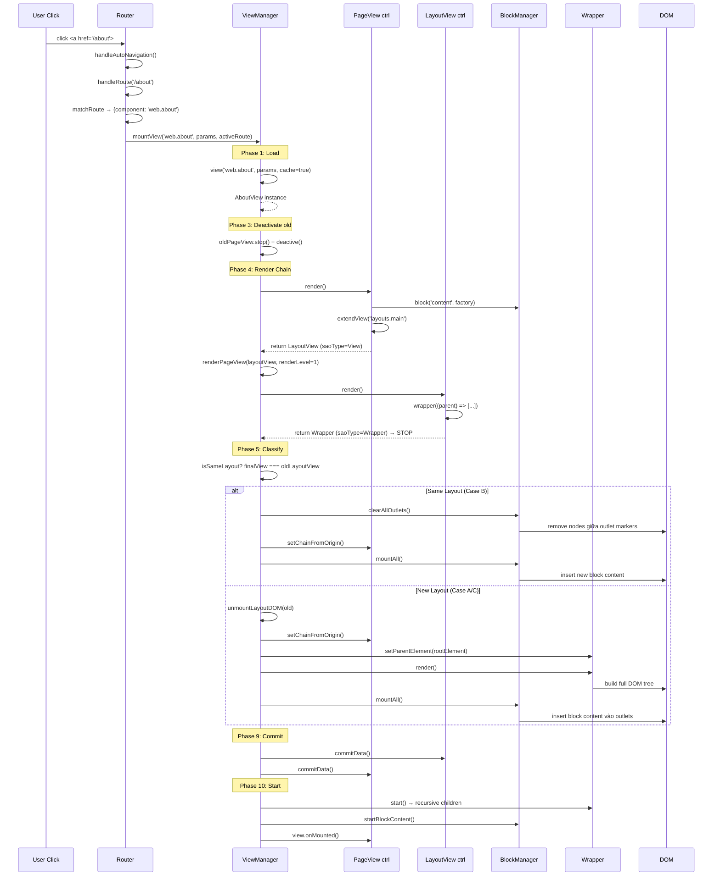

# MountView — Kế hoạch triển khai chi tiết

> Tài liệu triển khai cho luồng `Router → ViewManager.mountView() → DOM`.
> Dựa trên phân tích source code hiện tại và các gap cần hoàn thiện.

---

## Tổng quan luồng 10 bước

```
Router.handleRoute()
  │
  ▼
1. ViewManager.mountView(name, data, route)
  │
  ├─ 2. Load/Cache View Instance ──── view()
  │
  ├─ 3. Deactivate Old Views ──────── stop + deactive
  │
  ├─ 4. Render Chain (đệ quy) ────── renderPageView()
  │     └─ render() → View? → recurse
  │     └─ render() → Wrapper? → DONE
  │
  ├─ 5. Classify Mount Scenario ───── same layout / new layout / standalone
  │
  ├─ 6. Cleanup Old DOM ──────────── clearOutlets / unmountDOM
  │
  ├─ 7. Build New DOM ────────────── Wrapper.render() → Html.render() → ...
  │
  ├─ 8. Mount Blocks ─────────────── BlockManager.mountAll()
  │
  ├─ 9. Commit Data ──────────────── commitViewChain()
  │
  └─ 10. Start (activate) ────────── startViewChain() → onMounted()
```

---

## Bước 1: Router bắt route → gọi mountView

**File**: [Router.ts](file:///Users/doanln/Desktop/2026/Projects/saolabs/client/src/core/routers/Router.ts#L492-L543)

**Trạng thái**: ✅ Đã implement

```typescript
// Router.handleRoute() — line 492
private async handleRoute(path: string): Promise<void> {
    const match = this.matchRoute(normalizedPath);
    const activeRoute = new ActiveRoute(route, normalizedPath, params, query, fragment);
    
    // Gọi ViewManager.mountView
    await this.viewManager.mountView(viewComponent, params, activeRoute);
}
```

**Trigger points:**
- `navigate(path)` / `push(path)` — user navigation
- `handlePopState()` — browser back/forward  
- `handleAutoNavigation(e)` — click interception (`<a>`, `[data-nav-link]`)

---

## Bước 2: Load/Cache View Instance

**File**: [ViewManager.ts](file:///Users/doanln/Desktop/2026/Projects/saolabs/client/src/core/view/ViewManager.ts#L213-L242)

**Trạng thái**: ✅ Đã implement

```typescript
view(name, data, cache = true) {
    // 1. Check cache (StoreService)
    if (cache && this.store.has(name)) {
        const cached = this.store.get(name);
        if (hasData(data)) cached.__ctrl__.updateData(data);
        return cached;
    }
    // 2. Gọi factory từ registry → View instance
    //    factory() → new XxxView() → constructor → $__setup__() → ctrl.setup(config)
    const view = factory(data ? { data } : {}, { App, View: this, ...systemData });
    // 3. Cache
    if (cache) this.store.set(name, view);
    return view;
}
```

**Lưu ý**: Cache hit → KHÔNG gọi lại constructor, chỉ `updateData()`.

---

## Bước 3: Deactivate Old Views

**File**: [ViewManager.ts](file:///Users/doanln/Desktop/2026/Projects/saolabs/client/src/core/view/ViewManager.ts#L434-L439)

**Trạng thái**: ⚠️ Implement cơ bản, thiếu cleanup logic

```typescript
// Hiện tại:
if (oldLayoutView) {
    oldLayoutView.__ctrl__.stop();
    oldLayoutView.__ctrl__.deactive();
}
oldPageView?.__ctrl__.stop();
oldPageView?.__ctrl__.deactive();
```

### 🔧 CẦN BỔ SUNG

```typescript
// Cần thêm: clear block content trước khi render mới
if (oldPageView && oldLayoutView) {
    // Clear mounted block children khỏi DOM
    this.blockManager.clearAllOutlets();
}
```

**Vấn đề**: Hiện tại stop/deactive chạy TRƯỚC render chain mới. Nếu render chain fail, old view đã bị deactivate → không rollback được.

**Giải pháp đề xuất**: Defer deactivation sang sau Phase 4 (render chain success).

---

## Bước 4: Render Chain (Đệ quy)

**File**: [ViewManager.ts](file:///Users/doanln/Desktop/2026/Projects/saolabs/client/src/core/view/ViewManager.ts#L278-L407)

**Trạng thái**: ✅ Đã implement

### Luồng đệ quy

```
callViewRenderFactory(pageView, 'render')
  │
  ├─ ctrl.render() → renderFactory()
  │
  ├─ Kết quả saoType === 'Wrapper'?
  │   └─ YES → return Success (dừng đệ quy)
  │
  └─ Kết quả saoType === 'View'?
      └─ YES → renderPageView(superView, ..., renderLevel + 1)  ← ĐỆ QUY
               │
               └─ Lặp lại cho đến khi gặp Wrapper
```

### Điều gì xảy ra trong render() của từng loại view?

**Page View** (extends layout):
```javascript
render: () => {
    // 1. Đăng ký block (CHƯA render DOM)
    ctrl.block('b-content', 'content', (parent) => [...]);
    // → BlockManager.add(block) + BlockManager.active('content', viewId)
    
    // 2. Return super view (trigger đệ quy)
    return ctrl.extendView('layouts.main', {});
    // → ViewManager.view('layouts.main', {}, true) → cache/create layout
    // → ctrl.setSuperView(layout.__ctrl__)
    // → return layout (saoType === 'View')
}
```

**Layout View** (terminal — trả về Wrapper):
```javascript
render: () => {
    return ctrl.wrapper((parent) => [
        ctrl.html('el-1', 'div', parent, {...}, (parent) => [
            ctrl.useBlock('ob-content', 'content', parent),
            // → new BlockOutlet(...) — CHƯA render vào DOM
        ])
    ]);
    // → new Wrapper({childrenFactory}) — CHƯA execute factory
    // → return Wrapper (saoType === 'Wrapper') → DỪNG đệ quy
}
```

### Kết quả Phase 4

```typescript
RenderPageViewSuccess {
    view: PageView,           // view gốc
    result: LayoutView,       // kết quả render() = super view  
    superView: LayoutView,    // super view
    finalView: LayoutView     // view cuối cùng (có Wrapper)
}
```

### Async Data (3 sub-cases)

| Case | Điều kiện | Hành vi |
|------|-----------|---------|
| Sync | Không có `@await`/`@fetch` | `ctrl.render()` trực tiếp |
| Async + Prerender | Có `@await` + có `prerender()` | Render skeleton → fire-and-forget fetch → swap DOM |
| Async blocking | Có `@await`, không prerender | `await Http.get()` → render sau khi có data |

### ⚠️ GAP: Async prerender swap chưa implement

```typescript
// Line 376-379 — TODO markers:
// TODO: swap preloadElement → mainElement trong DOM
// ctrl.preloadElement?.destroy();
// ctrl.mainElement?.setParentElement(mountRoot);
// ctrl.mainElement?.render();
```

---

## Bước 5: Classify Mount Scenario

**File**: [ViewManager.ts](file:///Users/doanln/Desktop/2026/Projects/saolabs/client/src/core/view/ViewManager.ts#L456-L464)

**Trạng thái**: ⚠️ Phân loại cơ bản, thiếu Case B và Case C handling

```typescript
const isSameLayout = hasSuperView
    && oldLayoutView !== null
    && finalView === oldLayoutView;  // same instance (cached)
```

### 4 Scenarios

| Scenario | Điều kiện | Hành động |
|----------|-----------|-----------|
| **A: First Mount** | `oldLayoutView === null && oldPageView === null` | Fresh mount toàn bộ |
| **B: Same Layout** | `finalView === oldLayoutView` | Chỉ swap block content |
| **C: Different Layout** | `hasSuperView && finalView !== oldLayoutView` | Full swap layout + page |
| **D: Standalone** | `!hasSuperView` | Mount trực tiếp, no blocks |

### 🔧 CẦN IMPLEMENT: Xử lý đầy đủ cho từng scenario

```typescript
async mountView(name, data, route, navigationType) {
    // ... Phase 1-2 ...
    
    const isFirstMount = !oldLayoutView && !oldPageView;
    const isSameLayout = hasSuperView && oldLayoutView !== null 
                         && finalView === oldLayoutView;
    const isDifferentLayout = hasSuperView && !isSameLayout;
    const isStandalone = !hasSuperView;
    
    // Duplicate navigation guard
    if (oldPageView === pageView 
        && view.__ctrl__.urlPath === oldPageView?.__ctrl__?.urlPath) {
        return renderResult;
    }
    
    // ── CLEANUP OLD ──
    if (isSameLayout) {
        // Case B: Giữ layout, chỉ swap page
        this.stopBlockContent();
        this.blockManager.clearAllOutlets();
    } else if (!isFirstMount) {
        // Case C/D: Full cleanup
        this.stopBlockContent();
        this.stopLayoutView(oldLayoutView);
        this.blockManager.clearAllOutlets();
        this.unmountLayoutDOM(oldLayoutView);
    }
    
    // ── BUILD NEW ──
    if (isStandalone) {
        // Case D
        this.buildStandaloneDOM(pageView);
    } else if (isSameLayout) {
        // Case B: Layout DOM đã có, chỉ mount new blocks
        pageView.__ctrl__.setChainFromOrigin();
        this.blockManager.mountAll();
    } else {
        // Case A & C: Build layout DOM + mount blocks
        pageView.__ctrl__.setChainFromOrigin();
        this.buildViewDOM(finalView);
        this.blockManager.mountAll();
    }
    
    // ── COMMIT & START ──
    this.commitViewChain(pageView, finalView, hasSuperView);
    this.startViewChain(pageView, finalView, hasSuperView);
    
    // ── UPDATE STATE ──
    this.currentPageView = pageView;
    this.currentLayoutView = hasSuperView ? finalView : null;
    this.currentLayoutPath = newLayoutPath;
}
```

---

## Bước 6: Cleanup Old DOM

**Trạng thái**: ⚠️ Cần hoàn thiện

### Same Layout (Case B) — Chỉ clear block content

```typescript
// 1. Stop block mounted children
this.stopBlockContent();

// 2. Clear DOM nodes giữa outlet markers  
this.blockManager.clearAllOutlets();
// → Cho mỗi outlet: destroy children → remove DOM nodes giữa markers

// 3. Eject origin chain (ngắt old page khỏi layout)
oldLayoutView.__ctrl__.ejectOriginChain();
```

### Different Layout (Case C) — Full unmount

```typescript
// 1. Stop everything
this.stopBlockContent();
this.stopLayoutView(oldLayoutView);

// 2. Clear all block data
this.blockManager.clearAllOutlets();

// 3. Unmount layout DOM
this.unmountLayoutDOM(oldLayoutView);
// → wrapper.destroy() → clear children → remove markers

// 4. Optional: cache layout cho future reuse
this.cachedLayouts.set(oldLayoutPath, oldLayoutView);
```

---

## Bước 7: Build New DOM — Wrapper.render() ⚠️ CRITICAL GAP

**File**: [Wrapper.ts](file:///Users/doanln/Desktop/2026/Projects/saolabs/client/src/core/elements/Wrapper.ts#L81-L84)

**Trạng thái**: ❌ CHƯA IMPLEMENT — `render()` rỗng

### Implement cần thiết

```typescript
// Wrapper.ts — render()
render(): void {
    if (!this.parent?.element) return;
    const parentEl = this.parent.element;
    
    // 1. Clear existing content nếu re-render
    if (this.children.length > 0) {
        this.clear();
    }
    
    // 2. Append start marker
    parentEl.appendChild(this.openTag);
    
    // 3. Execute children factory
    if (this.childrenFactory) {
        const output = this.childrenFactory(this.parent);
        
        if (Array.isArray(output)) {
            for (const child of output) {
                if (typeof child === 'string' || typeof child === 'number') {
                    const textNode = document.createTextNode(String(child));
                    parentEl.insertBefore(textNode, null);
                    this.nodes.push(textNode);
                } else if (child && typeof child === 'object') {
                    if ('element' in child) {
                        // Html, TextElement — insert DOM element
                        parentEl.appendChild(child.element);
                        this.nodes.push(child.element);
                        this.children.push(child);
                        child.render();
                    } else if ('openTag' in child) {
                        // Reactive, Fragment, Output, BlockOutlet
                        if ('parent' in child) {
                            (child as any).parent = this.parent;
                        }
                        if ('parentElement' in child) {
                            (child as any).parentElement = this.parent;
                        }
                        this.children.push(child);
                        child.render();
                    }
                }
            }
        }
    }
    
    // 4. Append end marker
    parentEl.appendChild(this.closeTag);
}
```

### DOM tree kết quả

```
<div id="app">                          ← rootElement (container)
  <!--view:v_abc123-s-->                ← Wrapper.openTag
  <div class="layout-container">        ← Layout Html
    <header>Navigation</header>         ← Layout Html
    <main>                              ← Layout Html
      <!--blockoutlet:ob-content-s-->   ← BlockOutlet.openTag
      <!-- block content sẽ insert ở đây (Phase 8) -->
      <!--blockoutlet:ob-content-e-->   ← BlockOutlet.closeTag
    </main>
    <footer>© 2026</footer>            ← Layout Html
  </div>
  <!--view:v_abc123-e-->                ← Wrapper.closeTag
</div>
```

---

## Bước 8: Mount Blocks

**File**: [BlockManager.ts](file:///Users/doanln/Desktop/2026/Projects/saolabs/client/src/core/services/BlockManager.ts#L98-L153)

**Trạng thái**: ⚠️ Implement cơ bản, thiếu outlet registration

### Luồng hiện tại

```
BlockManager.mountAll()
  │
  ├─ Duyệt activeBlocks (name → Block)
  │
  ├─ Tìm BlockOutlet matching (by name)
  │
  └─ mountBlockIntoOutlet(block, outlet)
       │
       ├─ block.contentRenderFactory(ctx) → children[]
       │
       ├─ Insert mỗi child vào DOM giữa outlet markers
       │   ├─ Html: parentEl.insertBefore(child.element, outlet.closeTag)
       │   └─ Reactive/Fragment/Output: child.render()
       │
       └─ Track: mountedChildren.set(outlet.name, children)
```

### ⚠️ GAP: BlockOutlet chưa đăng ký vào BlockManager

**Vấn đề**: Trong `ViewController.blockOutlet()` (line 559-573), outlet được tạo và lưu vào `this.elements` nhưng **KHÔNG gọi `BlockManager.addOutlet()`**.

**Fix cần thiết**:

```typescript
// ViewController.ts — blockOutlet()
blockOutlet(id, name, parentElement): BlockOutletInterface {
    // ... existing code ...
    const outlet = new BlockOutlet({ ctx: this, name, id, parentElement, initMode });
    this.elements.set(id, outlet);
    
    // ✅ THÊM: Đăng ký outlet vào BlockManager
    BlockManager.addOutlet(`${this.viewId}:${name}`, outlet);
    
    return outlet;
}
```

---

## Bước 9: Commit Data

**File**: [ViewManager.ts](file:///Users/doanln/Desktop/2026/Projects/saolabs/client/src/core/view/ViewManager.ts#L602-L609)

**Trạng thái**: ⚠️ Method `commitData()` rỗng

### Hiện tại

```typescript
// ViewController.ts line 398-399
commitData(): void {
    // EMPTY
}
```

### Implement cần thiết

```typescript
commitData(): void {
    if (this._isDataCommitted) return;
    this._isDataCommitted = true;
    
    // Gọi commitConstructorData từ compiled output
    if (this.runtimeConfig?.commitConstructorData) {
        this.runtimeConfig.commitConstructorData();
    }
    
    // Lock state updates sau initialization
    this.states.__.lockUpdateRealState();
}
```

**Thứ tự commit**: Layout trước → Page sau (top-down).

---

## Bước 10: Start — Activate Reactivity

**File**: [ViewManager.ts](file:///Users/doanln/Desktop/2026/Projects/saolabs/client/src/core/view/ViewManager.ts#L553-L598)

**Trạng thái**: ✅ Implement cơ bản

### Luồng start

```
startViewChain(pageView, finalView, hasSuperView)
  │
  ├─ [Có layout]:
  │   ├─ startLayoutView(finalView)
  │   │   └─ wrapper.start() → recursive children start
  │   │       ├─ Html.start() → children.start()
  │   │       ├─ Reactive.start() → subscribe stateKeys
  │   │       ├─ Output.start() → subscribe stateKeys
  │   │       └─ BlockOutlet.start() → no-op
  │   │
  │   ├─ startBlockContent()
  │   │   └─ mountedChildren[name].forEach(child.start())
  │   │
  │   └─ pageView.onMounted()
  │
  └─ [Standalone]:
      ├─ wrapper.start() → recursive
      └─ pageView.onMounted()
```

---

## Tổng hợp GAPs và TODO

### Critical (phải fix để chạy được)

| # | Gap | File | Mức độ |
|---|-----|------|--------|
| 1 | `Wrapper.render()` rỗng | Wrapper.ts:81 | 🔴 Critical |
| 2 | `BlockOutlet` chưa register vào `BlockManager` | ViewController.ts:572 | 🔴 Critical |
| 3 | `commitData()` rỗng | ViewController.ts:398 | 🟡 High |

### High Priority (cần cho production)

| # | Gap | File | Mức độ |
|---|-----|------|--------|
| 4 | Mount scenario Case B/C chưa đủ logic | ViewManager.ts:466-494 | 🟡 High |
| 5 | Cleanup old views trước render chain (rollback risk) | ViewManager.ts:434-439 | 🟡 High |
| 6 | Async prerender → render swap chưa implement | ViewManager.ts:376 | 🟡 High |

### Medium Priority

| # | Gap | File | Mức độ |
|---|-----|------|--------|
| 7 | `YieldElement` chưa có content injection | Yield.ts | 🟠 Medium |
| 8 | Layout DOM caching (cachedLayouts) chưa dùng | ViewManager.ts:90 | 🟠 Medium |
| 9 | `Component.render()` / `Component.start()` rỗng | Component.ts:95-96 | 🟠 Medium |

---

## Thứ tự triển khai đề xuất

### Phase 1: Core Rendering (Bước 7)

**Mục tiêu**: Wrapper.render() hoạt động → DOM tree build được.

1. Implement `Wrapper.render()` theo mẫu Fragment.render()
2. Test: layout render → DOM xuất hiện trong container

### Phase 2: Block Connection (Bước 8)

**Mục tiêu**: Block content mount vào đúng outlet.

1. Fix `ViewController.blockOutlet()` → gọi `BlockManager.addOutlet()`
2. Test: page block content hiện trong layout outlet

### Phase 3: Data & Lifecycle (Bước 9-10)

**Mục tiêu**: State hoạt động, reactive updates.

1. Implement `commitData()` → gọi `commitConstructorData` + lock
2. Verify start chain → reactive subscriptions active
3. Test: click button → state change → DOM update

### Phase 4: Navigation Scenarios (Bước 5-6)

**Mục tiêu**: Navigate giữa các trang smooth.

1. Implement Case B (same layout swap)
2. Implement Case C (different layout swap)
3. Implement Case D (standalone)
4. Test: navigate `/home` → `/about` (same layout) → `/login` (standalone)

### Phase 5: Async & Caching

**Mục tiêu**: Async data fetch + layout caching.

1. Implement prerender → render swap
2. Implement layout DOM caching
3. Test: async data loading + back/forward

---

## Sequence Diagram — Full Happy Path



---

## Code Changes Summary

### File 1: `Wrapper.ts` — Implement render()

```diff
 render(): void {
-    
+    if (!this.parent?.element) return;
+    const parentEl = this.parent.element;
+    
+    if (this.children.length > 0) {
+        this.clear();
+    }
+    
+    parentEl.appendChild(this.openTag);
+    
+    if (this.childrenFactory) {
+        const output = this.childrenFactory(this.parent);
+        if (Array.isArray(output)) {
+            for (const child of output) {
+                if (typeof child === 'string' || typeof child === 'number') {
+                    const textNode = document.createTextNode(String(child));
+                    parentEl.appendChild(textNode);
+                    this.nodes.push(textNode);
+                } else if (child && typeof child === 'object') {
+                    if ('element' in child) {
+                        parentEl.appendChild(child.element);
+                        this.nodes.push(child.element);
+                        this.children.push(child);
+                        child.render();
+                    } else if ('openTag' in child) {
+                        if ('parent' in child) (child as any).parent = this.parent;
+                        if ('parentElement' in child) (child as any).parentElement = this.parent;
+                        this.children.push(child);
+                        child.render();
+                    }
+                }
+            }
+        }
+    }
+    
+    parentEl.appendChild(this.closeTag);
 }
```

### File 2: `ViewController.ts` — Fix blockOutlet registration + commitData

```diff
 blockOutlet(id, name, parentElement): BlockOutletInterface {
     // ...existing...
     const outlet = new BlockOutlet({ ctx: this, name, id, parentElement, initMode });
     this.elements.set(id, outlet);
-    // do something if needed
+    BlockManager.addOutlet(`${this.viewId}:${name}`, outlet);
     return outlet;
 }
```

```diff
 commitData(): void {
+    if (this._isDataCommitted) return;
+    this._isDataCommitted = true;
+    if (this.runtimeConfig?.commitConstructorData) {
+        this.runtimeConfig.commitConstructorData();
+    }
+    this.states.__.lockUpdateRealState();
 }
```

### File 3: `ViewManager.ts` — Full mount scenario handling

Cần refactor `mountView()` theo pseudocode ở Bước 5 phía trên, thêm:
- Case B: same layout swap (clear outlets → mount new blocks)
- Case C: different layout (full unmount → build new)
- Gọi `setChainFromOrigin()` và `ejectOriginChain()` đúng timing
- Gọi `commitViewChain()` và `startViewChain()` sau DOM build
