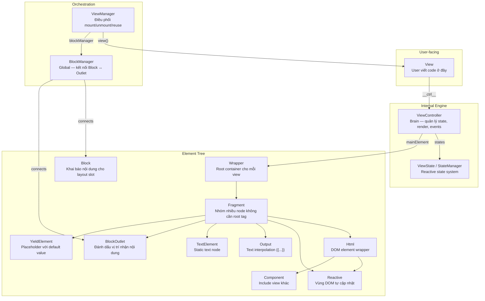
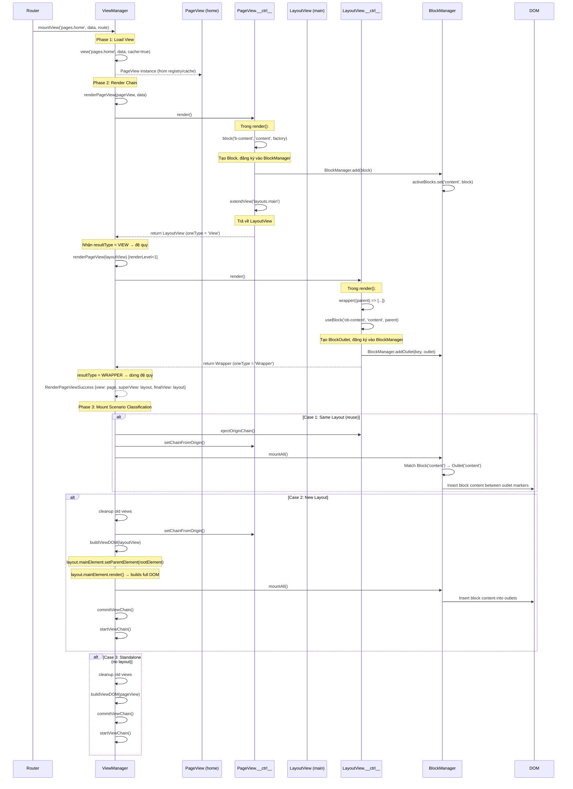
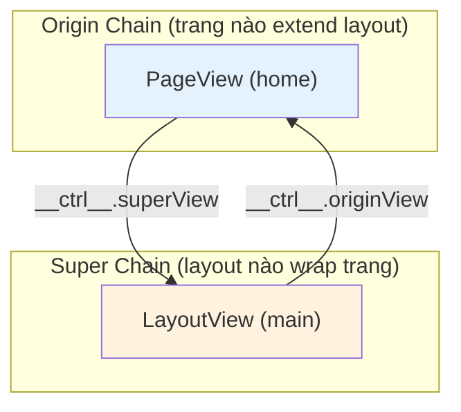

# Saola View System — Kiến trúc Layout Composition

## Tổng quan

Hệ thống view của Saola lấy cảm hứng từ **Laravel Blade** nhưng chạy hoàn toàn phía client, với khác biệt cốt lõi:

| Aspect | Laravel Blade | Saola |
|--------|--------------|-------|
| Render | Server-side → HTML string | Client-side → Element tree (DOM trực tiếp) |
| Layout | `@extends` + `@section`/`@yield` | `extendView()` + `@block`/`@useBlock`/`@yield` |
| Reactivity | Không có (static HTML) | Reactive regions — cập nhật DOM theo state change |
| Navigation | Full page reload | SPA — chỉ swap phần thay đổi, reuse layout |

---

## 1. Kiến trúc Tổng thể — Class Hierarchy



---

## 2. Layout Composition — Tương đương Laravel Blade

### 2.1 Blade Pattern (tham khảo)

```blade
{{-- layouts/main.blade.php --}}
<html>
<body>
    <nav>...</nav>
    @yield('content')          ← Đánh dấu vị trí nhận nội dung
    <footer>...</footer>
</body>
</html>
```

```blade
{{-- pages/home.blade.php --}}
@extends('layouts.main')      ← Khai báo sử dụng layout nào

@section('content')            ← Khai báo nội dung cho slot
    <h1>Home Page</h1>
@endsection
```

### 2.2 Saola Equivalent

Trong Saola, cơ chế tương tự được thực hiện qua:

| Blade Directive | Saola Runtime Method | Class/Element |
|----------------|---------------------|---------------|
| `@extends('layouts.main')` | `ctrl.extendView('layouts.main')` | Trả về `ViewInterface` (superView) |
| `@yield('content')` | `ctrl.useBlock(id, 'content', parent)` | `BlockOutlet` — chèn comment markers |
| `@section('content')` | `ctrl.block(id, 'content', factory)` | `Block` — lưu factory function |
| `@include('partials.nav')` | `ctrl.include(id, 'partials.nav', parent, ...)` | `Component` |

### 2.3 Compiled Output (dự kiến từ compiler)

**Layout view** (`layouts.main`) — compiled JS:

```javascript
// layouts/main.js — compiled output
class MainLayoutView extends View {
    $__setup__(__data__, sys) {
        const ctrl = this.__ctrl__;
        
        ctrl.setup({
            path: 'layouts.main',
            viewType: 'layout',
            render: () => {
                // ctrl.wrapper() → tạo Wrapper (root container)
                return ctrl.wrapper((parent) => [
                    // <html>
                    ctrl.html('el-1', 'div', parent, { attrs: { class: { type: 'value', value: 'layout-main' } } }, (parent) => [
                        // <nav>...</nav>
                        ctrl.html('el-2', 'nav', parent, {}, (parent) => [
                            ctrl.text('Navigation')
                        ]),
                        
                        // @useBlock('content') → tạo BlockOutlet
                        ctrl.useBlock('ob-content', 'content', parent),
                        
                        // <footer>...</footer>
                        ctrl.html('el-3', 'footer', parent, {}, (parent) => [
                            ctrl.text('Footer')
                        ]),
                    ]),
                ]);
            }
        });
    }
}
```

**Page view** (`pages.home`) — compiled JS:

```javascript
// pages/home.js — compiled output
class HomeView extends View {
    $__setup__(__data__, sys) {
        const ctrl = this.__ctrl__;
        
        ctrl.setup({
            path: 'pages.home',
            superView: 'layouts.main',  // ← @extends
            render: () => {
                // @block('content') → khai báo nội dung
                ctrl.block('b-content', 'content', (parent) => [
                    ctrl.html('el-10', 'h1', parent, {}, (parent) => [
                        ctrl.text('Home Page')
                    ]),
                ]);
                
                // @extends → return superView
                return ctrl.extendView('layouts.main', __data__);
            }
        });
    }
}
```

---

## 3. Luồng hoạt động chi tiết của `mountView`



---

## 4. Block System — Chi tiết từng thành phần

### 4.1 `Block` ([Block.ts](file:///Users/doanln/Desktop/2026/Projects/saolabs/client/src/core/elements/Block.ts))

**Vai trò**: Đại diện cho nội dung mà page view muốn "đẩy" vào layout.

- Tương đương `@section('content')...@endsection` trong Blade
- Được tạo bởi `ctrl.block(id, name, contentRenderFactory)`
- `contentRenderFactory`: function nhận `parentElement` → trả về mảng element children
- Mỗi Block gắn với một `viewId` (ID của page view tạo ra nó)
- Đăng ký vào `BlockManager.blocks` và `BlockManager.activeBlocks`

```
Block {
    name: 'content'           // Tên slot
    viewId: 'v_abc123'        // Page view nào tạo
    contentRenderFactory: (parent) => [...]  // Factory tạo DOM
    openTag: <!--block-start-->
    closeTag: <!--block-end-->
}
```

### 4.2 `BlockOutlet` ([BlockOutlet.ts](file:///Users/doanln/Desktop/2026/Projects/saolabs/client/src/core/elements/BlockOutlet.ts))

**Vai trò**: Đánh dấu vị trí trong layout DOM nơi block content sẽ được chèn vào.

- Tương đương `@yield('content')` trong Blade
- Được tạo bởi `ctrl.useBlock(id, name, parent)` (alias cho `blockOutlet()`)
- Khi `render()`: chèn 2 comment markers (`<!--blockoutlet-start-->` / `<!--blockoutlet-end-->`) vào parent DOM
- Block content sẽ được chèn **giữa** 2 markers này

```
BlockOutlet {
    name: 'content'           // Tên slot (phải khớp với Block.name)
    parentElement: <div>      // DOM parent
    openTag: <!--blockoutlet-start-->
    closeTag: <!--blockoutlet-end-->
}
```

### 4.3 `BlockManager` ([BlockManager.ts](file:///Users/doanln/Desktop/2026/Projects/saolabs/client/src/core/services/BlockManager.ts))

**Vai trò**: Global singleton — kết nối Block ↔ BlockOutlet.

Dữ liệu chính:
- `blocks: Map<key, BlockInterface>` — key = `name + viewId`
- `blockOutlets: Map<key, BlockOutletInterface>` — key = `viewId:blockName`
- `activeBlocks: Map<name, BlockInterface>` — block đang active cho mỗi slot name
- `mountedChildren: Map<name, children[]>` — tracked children cho cleanup

**`mountAll()`** — phương thức then chốt:
1. Duyệt qua tất cả `activeBlocks` theo tên
2. Tìm `BlockOutlet` tương ứng (matching by name)
3. Gọi `block.contentRenderFactory(outlet.parentElement)` để tạo element children
4. Chèn children vào DOM giữa `outlet.openTag` và `outlet.closeTag`
5. Track children vào `mountedChildren` cho cleanup sau

### 4.4 `YieldElement` ([Yield.ts](file:///Users/doanln/Desktop/2026/Projects/saolabs/client/src/core/elements/Yield.ts))

**Vai trò**: Placeholder đơn giản — có thể hiển thị default value.

- Khác với BlockOutlet ở chỗ: `Yield` có thể có `defaultValue` và `contentFactory`
- `ctrl.yield(id, name, defaultValue, parent)` — tạo yield element
- `ctrl.yieldContent(name, default)` — lấy nội dung từ parent view qua `App.View`

> [!NOTE]
> Yield hiện tại chưa có logic chèn content giữa markers. `render()` chỉ chèn markers rỗng. Đây có thể là phần cần phát triển thêm.

### 4.5 `Section` ([Section.ts](file:///Users/doanln/Desktop/2026/Projects/saolabs/client/src/core/view/Section.ts)) — Legacy

- Section đang được **phased out** theo comment trong code
- Thay thế bằng Block/BlockOutlet system
- Hỗ trợ 4 loại: `static`, `dynamic`, `async`, `reactive`
- Có cơ chế subscribe state changes (reactive sections)

---

## 5. View Hierarchy — superView / originView

### 5.1 Quan hệ giữa các View



- **`superView`**: Page view trỏ lên layout (con → cha)
- **`originView`**: Layout trỏ xuống page view (cha → con)
- **`extendView(path)`**: Thiết lập `superView` chain
- **`setChainFromOrigin()`**: Đệ quy đi lên chuỗi super, set `originView` cho mỗi level
- **`ejectOriginChain()`**: Đệ quy ngắt `originView` (cho cleanup khi swap page)

### 5.2 Tại sao cần origin chain?

Khi BlockManager cần mount block content vào layout, nó cần biết:
- Block thuộc page view nào? → `block.viewId` + `block.ctx`
- Layout nào đang active? → `ViewManager.currentLayoutView`
- Page nào đang active? → `ViewManager.currentPageView`

Origin chain cho phép layout "nhìn ngược" về page để lấy thông tin khi cần.

---

## 6. Ba kịch bản mount trong `mountView`

### Case 1: Cùng Layout — Reuse (tối ưu nhất)

```
Navigation: /home → /about (cả hai dùng layouts.main)

Trước:  Layout(main) → Page(home)
Sau:    Layout(main) → Page(about)  ← Layout giữ nguyên DOM

Các bước:
1. oldLayoutView.__ctrl__.ejectOriginChain()   // Ngắt home khỏi layout
2. pageView.__ctrl__.setChainFromOrigin()       // Gắn about vào layout
3. blockManager.mountAll()                       // Chỉ swap block content
   - clearOutlet('content')  → xóa DOM children của home
   - mountBlockIntoOutlet()  → render about's block content vào outlet
```

> [!TIP]
> Đây là điểm mạnh nhất: layout DOM (nav, footer, sidebar) **không bị re-render**, chỉ thay đổi phần content bên trong các block outlets.

### Case 2: Layout khác — Full Rebuild

```
Navigation: /home (layouts.main) → /admin (layouts.admin)

Các bước:
1. Cleanup hoàn toàn:
   - ejectOriginChain, stop page & layout views
   - clearAllOutlets, unmountLayoutDOM (remove from DOM)
2. Build mới:
   - setChainFromOrigin (about → admin layout)
   - buildViewDOM(adminLayout)  → render layout vào container
   - mountAll()                  → chèn page block content
   - commitViewChain + startViewChain
```

### Case 3: Standalone — Không có Layout

```
Navigation: /login (không có @extends)

Các bước:
1. Cleanup old views
2. buildViewDOM(loginPage)  → render trực tiếp vào container
3. commitViewChain + startViewChain
```

---

## 7. Lifecycle Flow

```
┌─────────────────────────────────────────────────────────────────┐
│                     FULL LIFECYCLE FLOW                         │
├─────────────────────────────────────────────────────────────────┤
│                                                                 │
│  1. LOAD                                                        │
│     ViewManager.view(name) → factory() → new View()             │
│     └→ View constructor → new ViewController()                  │
│        └→ $__setup__() → ctrl.setup(config)                     │
│           └→ Store renderFactory, superViewPath, etc.            │
│                                                                 │
│  2. RENDER                                                      │
│     ViewManager.renderPageView()                                │
│     └→ ctrl.render() → renderFactory()                          │
│        ├→ ctrl.block('content', factory)  // Đăng ký block      │
│        ├→ ctrl.extendView('layouts.main') // Trả về layout      │
│        └→ Layout's ctrl.render()                                │
│           ├→ ctrl.wrapper((parent) => [...])                    │
│           ├→ ctrl.useBlock('content', parent) // Tạo outlet     │
│           └→ Return Wrapper (dừng đệ quy)                      │
│                                                                 │
│  3. MOUNT DOM                                                   │
│     ViewManager.buildViewDOM(finalView)                         │
│     └→ wrapper.setParentElement(rootElement)                    │
│     └→ wrapper.render()                                         │
│        └→ childrenFactory(parent) → render từng child           │
│           └→ Html.render(), Fragment.render()                   │
│              └→ BlockOutlet.render() → chèn markers vào DOM     │
│                                                                 │
│  4. MOUNT BLOCKS                                                │
│     BlockManager.mountAll()                                     │
│     └→ Match activeBlock('content') → outlet('content')         │
│     └→ block.contentRenderFactory(outlet.parentElement)         │
│        └→ Render page children vào giữa outlet markers          │
│                                                                 │
│  5. COMMIT DATA                                                 │
│     ViewManager.commitViewChain()                               │
│     └→ ctrl.commitData() → set initial state values             │
│                                                                 │
│  6. START                                                       │
│     ViewManager.startViewChain()                                │
│     └→ wrapper.start() → recursive start all children           │
│        └→ Reactive.start() → subscribe stateKeys                │
│        └→ Output.start() → subscribe contentFactory             │
│     └→ view.onMounted()                                         │
│                                                                 │
│  7. LIVE (reactive)                                             │
│     State change → StateManager.commitStateChange()             │
│     └→ Batch → RAF → flushChanges()                             │
│        └→ Notify listeners → Reactive.update()                  │
│           └→ clearContent() → re-run childrenFactory()          │
│                                                                 │
│  8. DEACTIVATE (navigate away)                                  │
│     ViewManager.stopPageView()                                  │
│     └→ stopBlockContent() → child.stop()                        │
│     └→ view.onDeactivated()                                     │
│                                                                 │
│  9. DESTROY (layout change or unmount)                          │
│     ViewManager.unmountLayoutDOM()                              │
│     └→ wrapper.destroy() → clear + remove markers               │
│     └→ ctrl.destroy() → abort events, clear state               │
│                                                                 │
└─────────────────────────────────────────────────────────────────┘
```

---

## 8. Các điểm cần lưu ý / Gaps hiện tại

### 8.1 `Wrapper.render()` — Chưa implement

```typescript
// Wrapper.ts line 55-57
render(): void {
    // EMPTY — chưa có logic render
}
```

> [!WARNING]
> `ViewManager.buildViewDOM()` gọi `wrapper.render()`, nhưng method này rỗng. Điều này có nghĩa `buildViewDOM` hiện tại chưa thực sự tạo DOM. Cần implement logic tương tự `Fragment.render()` — gọi `childrenFactory`, duyệt output, append vào parent.

### 8.2 `Block.render()` — Không được dùng trực tiếp

Block không tự render. Thay vào đó, `BlockManager.mountBlockIntoOutlet()` gọi `block.contentRenderFactory()` và tự xử lý DOM insertion. `Block.render()` hiện tại gọi factory nhưng không làm gì với output.

### 8.3 `BlockOutlet` chưa đăng ký vào `BlockManager`

Trong `ViewController.blockOutlet()`, outlet được tạo và lưu vào `this.elements` nhưng **chưa gọi `BlockManager.addOutlet()`**. Việc đăng ký có thể xảy ra ở nơi khác hoặc đây là một gap.

```typescript
// ViewController.ts line 534-549
blockOutlet(id, name, parentElement): BlockOutletInterface {
    const outlet = new BlockOutlet({...});
    this.elements.set(id, outlet);
    // ← Không có BlockManager.addOutlet(key, outlet) ở đây
    return outlet;
}
```

### 8.4 `YieldElement` — Chưa có content injection logic

`YieldElement.render()` chỉ chèn markers rỗng. Chưa có cơ chế để layout "fill" content vào yield từ page view's section.

### 8.5 `commitData()` — Empty method

```typescript
// ViewController.ts line 388-389
commitData(): void {
    // EMPTY
}
```

Có `runtimeConfig.commitConstructorData` trong config nhưng `commitData()` chưa gọi nó.

---

## 9. Tóm tắt Data Flow

```
┌──────────────┐     ┌──────────────────┐     ┌──────────────────┐
│   .sao file  │────→│    Compiler       │────→│  Compiled JS     │
│              │     │  (../compiler)    │     │  (View subclass) │
│ @extends     │     │                  │     │  extendView()    │
│ @block       │     │                  │     │  block()         │
│ @useBlock    │     │                  │     │  useBlock()      │
│ @yield       │     │                  │     │  yield()         │
│ @foreach     │     │                  │     │  __foreach()     │
│ {{ expr }}   │     │                  │     │  output()        │
└──────────────┘     └──────────────────┘     └──────────────────┘
                                                       │
                                                       ▼
┌──────────────────────────────────────────────────────────────────┐
│                        Runtime Engine                            │
│                                                                  │
│  ViewManager.mountView(name)                                     │
│    ├→ Load View from registry                                    │
│    ├→ renderPageView() → resolve chain → get Wrapper             │
│    ├→ buildViewDOM() → Wrapper.render() → DOM tree               │
│    ├→ BlockManager.mountAll() → fill outlets with block content  │
│    ├→ commitViewChain() → initial state                          │
│    └→ startViewChain() → activate reactivity                     │
│                                                                  │
└──────────────────────────────────────────────────────────────────┘
```
